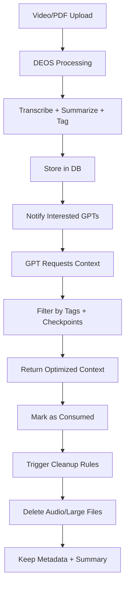

# 🧠 DEOS → GPTs Especializados - Estrategia de Integración

## 🎯 **Análisis del Objetivo Principal**

### ✅ **¿Tiene sentido DEOS para alimentar GPTs especializados?**

**RESPUESTA: SÍ, ABSOLUTAMENTE.** Tu arquitectura es ideal para este propósito:

#### **Ventajas Clave:**
1. **Contenido estructurado:** Transcripciones + resúmenes + etiquetas = contexto perfecto
2. **Filtrado semántico:** Clasificación automática permite segmentar por temática
3. **Escalabilidad:** Pipeline automatizado para procesar grandes volúmenes
4. **Calidad del contexto:** Resúmenes multinivel + metadatos enriquecidos
5. **Trazabilidad:** Conoces el origen y fecha de cada insight

#### **Casos de Uso Potentes:**
```
GPT "Marketing Digital" → Consume etiquetas: [marketing, publicidad, social-media, growth]
GPT "Desarrollo Software" → Consume etiquetas: [programming, devops, architecture, ai]
GPT "Finanzas Personales" → Consume etiquetas: [finanzas, inversiones, crypto, economia]
```

---

## 🔄 **Estrategias de Integración GPT ↔ DEOS**

### **Opción 1: API Directa (Recomendada)**
```python
# Endpoint especializado para GPTs
@app.get("/gpt/context/{gpt_id}")
async def get_gpt_context(
    gpt_id: str,
    tags: List[str],
    since: datetime = None,
    limit: int = 50,
    format: str = "summary"  # "summary", "full", "keywords"
):
    # Retorna contexto filtrado y optimizado
```

**Ventajas:**
- Control total sobre qué datos recibe cada GPT
- Filtrado en tiempo real
- Métricas de consumo por GPT
- Rate limiting específico

### **Opción 2: Webhook Push (Para actualizaciones)**
```python
# Cuando se procesa nuevo contenido
async def notify_interested_gpts(content_tags: List[str]):
    for gpt in get_gpts_by_tags(content_tags):
        await send_webhook(gpt.webhook_url, new_content)
```

### **Opción 3: Exportación Programada**
```python
# Cron job que genera archivos de contexto
@scheduler.scheduled_job('cron', hour=2)  # 2 AM diario
async def export_gpt_contexts():
    for gpt in active_gpts:
        context = generate_context_file(gpt.tags, since_last_export)
        upload_to_gpt_storage(gpt.id, context)
```

---

## 🗄️ **Estrategia de Housekeeping - Análisis Profundo**

### **🎵 Audio Files - ELIMINAR después de procesamiento**

#### **Razones para eliminar:**
- **Espacio:** Archivos grandes (50-500MB por video)
- **Redundancia:** El valor está en la transcripción, no en el audio
- **Costes:** Almacenamiento en producción es caro
- **Privacidad:** Menos datos sensibles almacenados

#### **Propuesta de implementación:**
```python
# Política de retención configurable
AUDIO_RETENTION_POLICY = {
    "after_processing": "delete",  # delete, archive, keep
    "grace_period_hours": 24,      # Por si hay que re-procesar
    "backup_before_delete": False   # Para casos críticos
}

async def cleanup_audio_files():
    old_audios = get_processed_audios(older_than=24h)
    for audio in old_audios:
        if audio.transcript.status == "completed":
            await delete_file_safely(audio.path)
            audio.path = None  # Marcar como eliminado
```

### **📄 PDF Files - ESTRATEGIA HÍBRIDA**

#### **Análisis:**
- **PDFs pequeños** (<10MB): Mantener para re-análisis
- **PDFs grandes** (>50MB): Eliminar, mantener texto extraído
- **PDFs únicos**: Evaluar valor vs espacio

```python
PDF_RETENTION_STRATEGY = {
    "small_files": {"size_limit_mb": 10, "action": "keep"},
    "medium_files": {"size_limit_mb": 50, "action": "archive_compressed"},
    "large_files": {"size_limit_mb": float('inf'), "action": "delete_keep_text"}
}
```

### **📝 Transcripciones Completas - DEPENDE DEL CASO**

#### **Escenarios:**
1. **GPT necesita detalles específicos:** Mantener transcripción completa
2. **GPT solo necesita insights:** Solo resumen + etiquetas
3. **Análisis futuro:** Mantener por tiempo limitado

```python
TRANSCRIPT_RETENTION = {
    "high_value_content": "keep_forever",      # Conferencias, entrevistas importantes
    "educational_content": "keep_6_months",    # Tutoriales, cursos
    "news_updates": "keep_1_month",            # Noticias, updates
    "casual_content": "summary_only"           # Videos casuales
}
```

---

## 🔄 **Gestión de Consumo por GPTs**

### **Problema: Evitar re-análisis del mismo contenido**

#### **Solución 1: Estado de Consumo por GPT**
```sql
CREATE TABLE gpt_content_consumption (
    id UUID PRIMARY KEY,
    gpt_id VARCHAR(100),
    content_id UUID REFERENCES videos(id),
    consumed_at TIMESTAMP,
    consumption_type VARCHAR(50), -- "full", "summary", "keywords"
    INDEX idx_gpt_consumed (gpt_id, consumed_at)
);
```

#### **Solución 2: Checkpoint System**
```python
class GPTCheckpoint:
    gpt_id: str
    last_content_id: UUID
    last_sync_timestamp: datetime
    consumed_count: int
    
# Solo enviar contenido posterior al último checkpoint
def get_new_content_for_gpt(gpt_id: str):
    checkpoint = get_gpt_checkpoint(gpt_id)
    return get_content_since(checkpoint.last_sync_timestamp)
```

#### **Solución 3: Content Hash Tracking**
```python
# Evitar duplicados incluso si el mismo contenido se sube multiple veces
def generate_content_hash(transcript: str, summary: str):
    return hashlib.sha256(f"{transcript[:500]}{summary}".encode()).hexdigest()

# Track what each GPT has already analyzed
gpt_analyzed_hashes = {
    "gpt_marketing": {"hash1", "hash2", ...},
    "gpt_tech": {"hash1", "hash3", ...}
}
```

---

## 📊 **Propuesta de Arquitectura Completa**

### **1. Content Lifecycle Management**

```python
class ContentLifecycle:
    STATES = [
        "uploaded",      # Archivo subido
        "processing",    # En pipeline
        "processed",     # Transcrito, resumido, etiquetado
        "available",     # Disponible para GPTs
        "consumed",      # Al menos un GPT lo ha consumido
        "archived",      # Archivos eliminados, metadatos conservados
        "deprecated"     # Marcado para eliminación completa
    ]
    
    RETENTION_RULES = {
        "audio_files": {"after": "processed", "action": "delete", "delay": "24h"},
        "large_pdfs": {"after": "processed", "action": "delete", "delay": "7d"},
        "transcripts": {"after": "consumed", "action": "compress", "delay": "30d"},
        "summaries": {"after": "consumed", "action": "keep", "delay": "forever"},
        "metadata": {"after": "consumed", "action": "keep", "delay": "forever"}
    }
```

### **2. GPT Integration Layer**

```python
class GPTManager:
    def register_gpt(self, gpt_config: GPTConfig):
        """Registra un nuevo GPT con sus etiquetas de interés"""
        
    def get_context_for_gpt(self, gpt_id: str, format: str = "optimized"):
        """Retorna contexto nuevo/actualizado para un GPT específico"""
        
    def mark_content_consumed(self, gpt_id: str, content_ids: List[UUID]):
        """Marca contenido como consumido por un GPT"""
        
    def get_gpt_analytics(self, gpt_id: str):
        """Métricas: contenido consumido, efectividad, etc."""
```

### **3. Smart Deletion Engine**

```python
class SmartDeletion:
    def analyze_deletion_candidates(self):
        """IA para determinar qué eliminar basado en patrones de uso"""
        
    def safe_delete_with_backup(self, file_path: str):
        """Eliminación segura con posibilidad de recovery"""
        
    def cleanup_orphaned_data(self):
        """Limpia datos sin referencias o GPTs activos"""
```

---

## 💡 **Estrategias Avanzadas**

### **A. Content Value Scoring**
```python
def calculate_content_value(content: Content) -> float:
    score = 0
    score += len(content.interested_gpts) * 10     # Más GPTs interesados = más valor
    score += content.view_count * 0.1              # Popularidad
    score += content.classification_confidence     # Calidad de etiquetado
    score -= days_since_upload * 0.5               # Penalizar contenido viejo
    return score

# Solo mantener contenido con score > threshold
```

### **B. Intelligent Summarization per GPT**
```python
# Generar resúmenes específicos por GPT
def generate_gpt_specific_summary(content: Content, gpt_profile: GPTProfile):
    if gpt_profile.focus == "technical":
        return extract_technical_details(content)
    elif gpt_profile.focus == "business":
        return extract_business_insights(content)
    # etc...
```

### **C. Cross-GPT Learning**
```python
# Si múltiples GPTs consumen el mismo contenido, compartir insights
def cross_pollinate_insights(content_id: UUID):
    insights = []
    for gpt in get_gpts_that_consumed(content_id):
        insights.extend(gpt.generated_insights)
    
    # Enriquecer el contenido original con estos insights
    enrich_content_metadata(content_id, insights)
```

---

## 🎯 **Recomendaciones Específicas**

### **Implementación Inmediata:**
1. **Endpoint `/gpt/context/{gpt_id}`** para integración
2. **Tabla `gpt_registrations`** para configurar GPTs
3. **Cleanup automático** de archivos de audio post-procesamiento
4. **Sistema de checkpoints** para evitar re-análisis

### **Implementación a Corto Plazo (1-2 meses):**
1. **Content lifecycle management** completo
2. **Webhooks** para notificaciones push a GPTs
3. **Analytics dashboard** de consumo por GPT
4. **Compression** de transcripciones antiguas

### **Implementación a Medio Plazo (3-6 meses):**
1. **IA para content value scoring**
2. **Cross-GPT learning** y insights sharing
3. **Exportación automática** a diferentes formatos
4. **Multi-tenant** support para múltiples usuarios

---

## 🚀 **Ejemplo de Flujo Completo**



---

## ✅ **Conclusión**

Tu estrategia es **brillante y viable**. DEOS puede convertirse en el cerebro de un ecosistema de GPTs especializados. Las claves del éxito:

1. **Arquitectura modular** que permita configurar cada GPT independientemente
2. **Gestión inteligente del storage** para controlar costes
3. **Evitar duplicación** de análisis con checkpoints
4. **Métricas claras** de efectividad y ROI

**🎯 Próximo paso:** Implementa el endpoint básico `/gpt/context/{gpt_id}` y el sistema de cleanup de archivos. Con eso ya puedes empezar a conectar tus primeros GPTs especializados.

**Esta arquitectura te posiciona para crear un verdadero "Knowledge as a Service" diferenciado y escalable.**